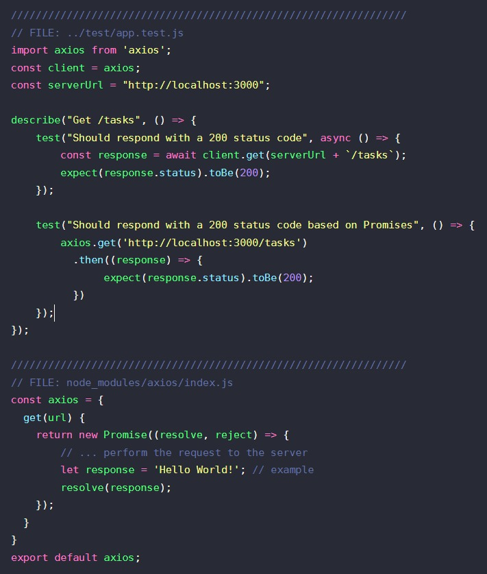

# NODEJS-JEST-SUPERTEST
Testing demo with Jest and Axios

```
// axios
// FILE: ../test/app.test.js
import axios from 'axios';
const client = axios;
const serverUrl = "http://localhost:3000";

describe("Get /tasks", () => {
    test("Should respond with a 200 status code", async () => {
        const response = await client.get(serverUrl + `/tasks`);
        expect(response.status).toBe(200);
    });
});
```
